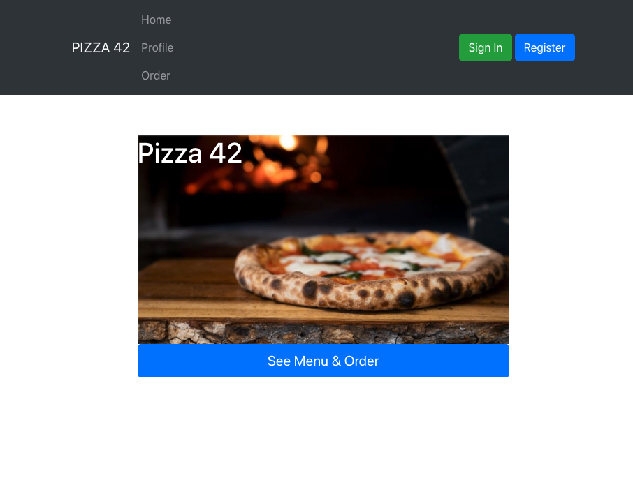

# pizzaFinal

App created with React Node Express and Auth0




## Hosted Version

https://geopizzaapp2020.herokuapp.com/
Note: Due to Content Security Policy in modern browsers, rendering scripts or URLs from 3rd parties (React scripts, boot strap style sheets, APIs, etc) may cause an error.

More Info:
https://developers.google.com/web/fundamentals/security/csp

## Get Started

Install the client project dependencies on both React Frontend (Client) & NodeJS backend (server in root).

```bash
npm init
```

```bash
cd client && npm init
```

Run the client project:

```bash
npm start
```

Run the server project:

```bash
cd server/server.js && node server.js
```

### Possible Troubleshooting steps on local env.
Default port for server 5000; For Client = 3000.

For local environments the API call to the URL should be to server where port is listening.

(ie. http://localhost:5000/ for server | http://localhost:3000 for client.)


### Dependencies

@auth0/auth0-react
react
react-bootstrap
react-dom
react-router-dom
react-scripts
react-syntax-highlighter
